STAGE: Count of Forecasted Dollar Amount (USD)
==============================================

This first plot shows the count (number of deals) and where they fall in
a range of US dollars ($) for the projected Forecasted Dollar Amount
(what the deal was proposed to the customer for). As you can see, the
vast majority of them fall in a range between USD 500 and USD 1 million,
with the concentration being between USD 1,000 and 900,000.

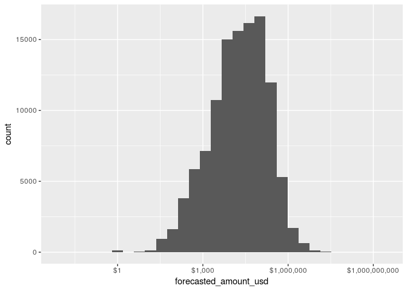

STAGE: Count of Expected Revenue Amount (USD)
=============================================

The Expected Revenue is the amount of money we expect to make from the
the deal when it closes and commits. A deal might be forecasted for USD
500,000, and the expected revenue might be USD 250,000 (meaning there
are USD 250,000 of costs).

The bar plot below for Expected should align with the plot above for
Forecasted. Are there noticeable differences in the shape or outline of
these plots? If they are closely match, that indicates that expected
revenue is aligned with the forecasted amount (meaning, costs are
controlled proportionate to the deal). If there is significant
difference, this would suggst that there is a misalignment between what
was Forecasted and what we Expect to make. For example: If Expected
Revenue looks significantly lower, that might indicate that the costs to
staff the project increased, meaning our internal costs consumed more
money, and the expected revenue decreased proprotionately.

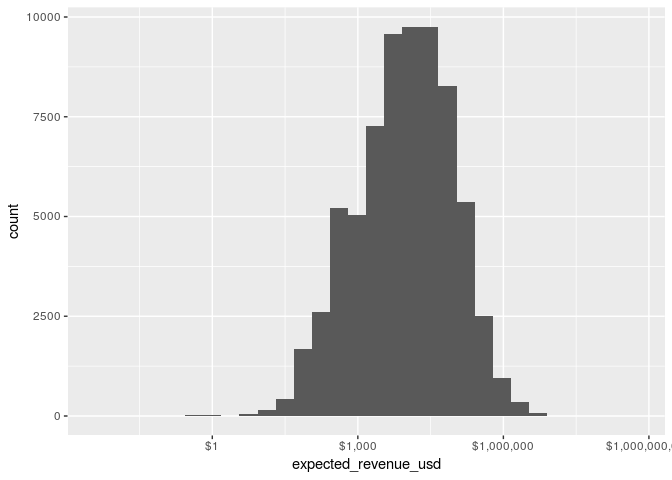

Is there a way to mount one graph on the other?
-----------------------------------------------

STAGE: Count by Year
====================

One of the original questions our group asked is, “What is overall
number of deals we WON AND CLOSED vs. DROPPED and LOST?”

To answer this question, plot a bar graph that shows the 5 categories in
Stage (simple\_stage) and the number of deals in each category. As you
can see in the chart below, only 3 of the categories (WON, LOST, WIP)
have the majority of the deals.
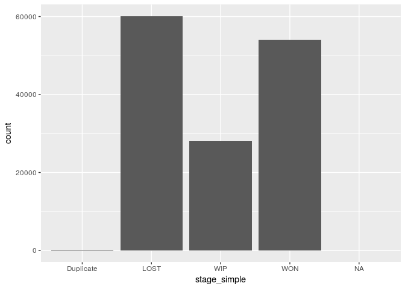

Then we wanted to know, “What is overall number of deals WON AND CLOSED,
vs. DROPPED and LOST, grouped by YEAR?”

Below are two bar graphs showing the same information.

1.  The first chart simply adds a fill to the previous chart (in which
    the Stage is our baseline X axis). This clearly shows 2017 had the
    highest counts of WON and LOST deals, more than 2016 or 2018.

2.  The first chart changes the X asis to the year, and instead uses the
    fill to identify the stage. This makes it less easier to quickly
    identify the year which had the highest counts, but does read
    nicely, and might be used for other charts (e.g. Industry).

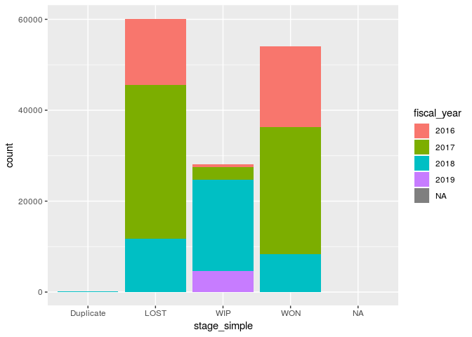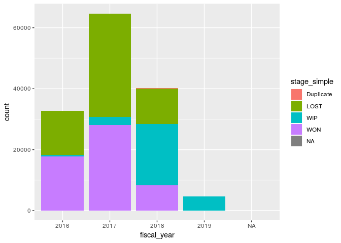

STAGE: Count by Industry
========================

We use the last bar graph as the basis for looking at the count by Stage
across the industries. However, this chart is nearly useless:
“Everything Else” dominates, while our areas of focus (Distribution,
Engineering, Utilities) reduced to very small amounts.

Update Industry Simple with Energy
==================================

It also appears we missed something in our additional cleaning
operation: Where is the “Energy” sector? Turns out, we lumped it with
“Everything Else” incorrectly. So we’ll perform an updated operation and
refresh our graphs.

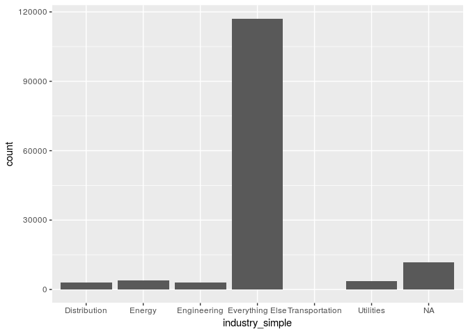

Now let’s filter out “Everything Else” and concentrate on the Industries
we selected: “Energy” , “Utilities”, “Engineering”,“Distribution”

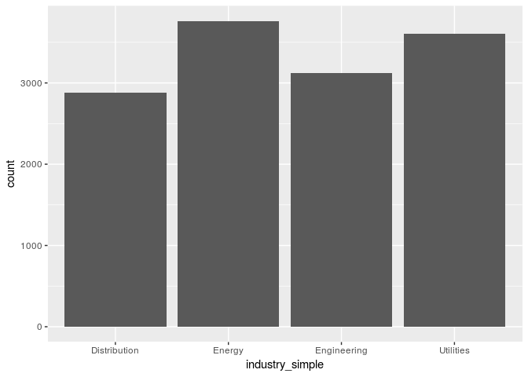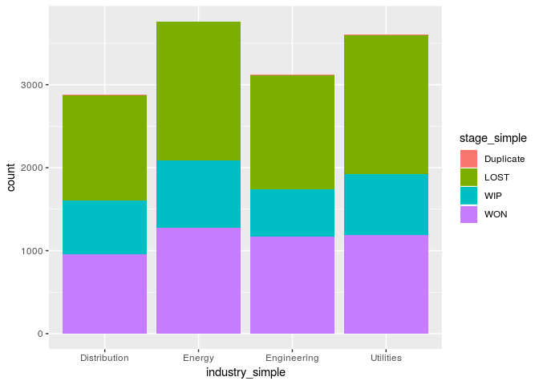

Energy (which comprises Oil, Gas, Fossil and Mineral industries) and
Utilities are the sectors with the most deals.

What if we break down by year?

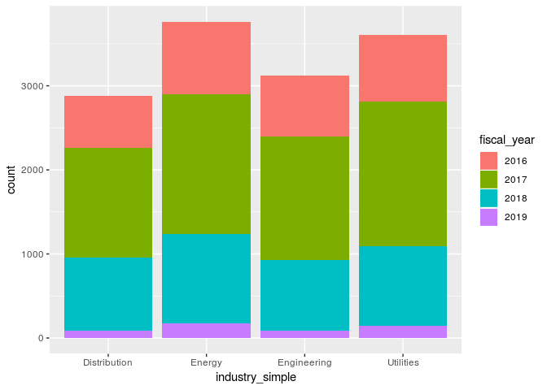

Size of Opportunities: Up to $50K

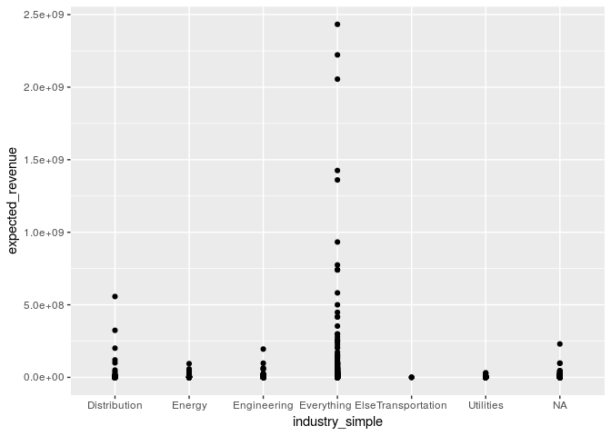

Size of Opportunities: $50K to $100K

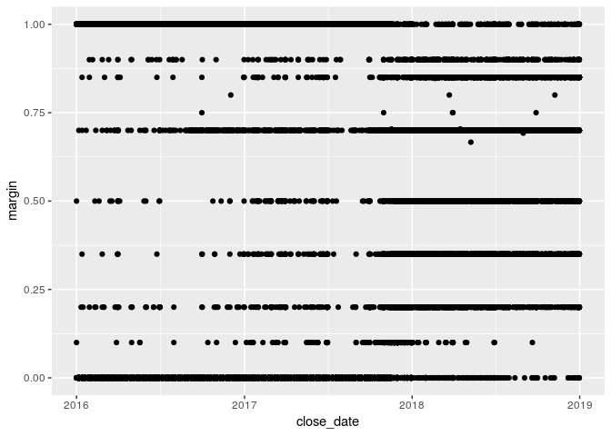

Size of Opportunities: $100K to $500K

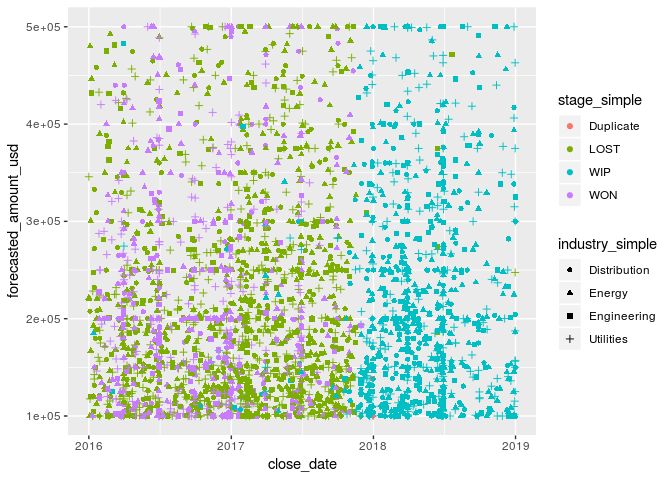

Size of Opportunities: $500K to $1M

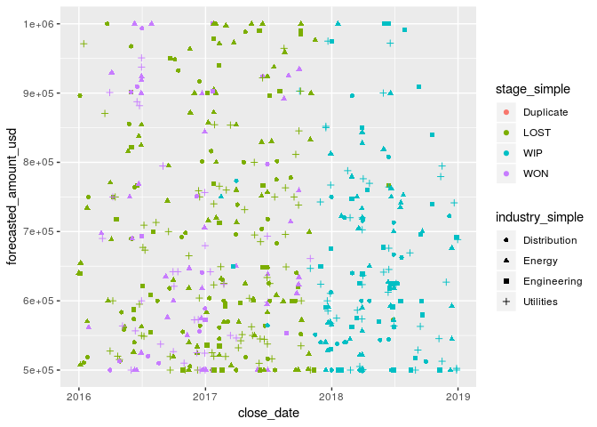

Size of Opportunities: $1M above

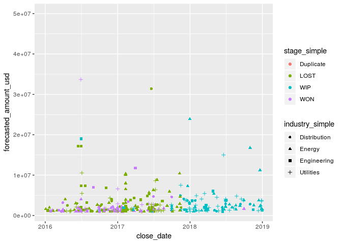

WON Opportunities: Up to $50K Try to smooth and see if pattern emerges
Take out the colors and shaping, and try to get into a smooth line

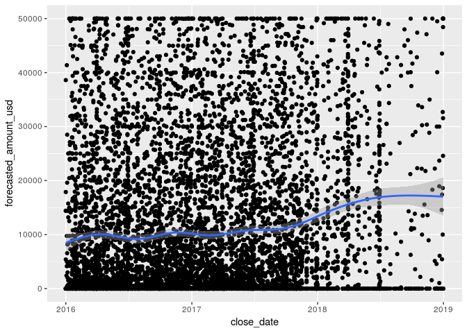

WON Opportunities: Up to $1M Smoothing work - now remove the points and
just see the line, colored by industry An interesting pattern emerges:
1. Utilities dollar amounts continuously increase over time 2.
Distribution and Engineering dollar amounts have gone down

HELP!!! How can get the lines to display WON, LOSS, WIP, as opposed to
industry? When we change the following to stage\_simple, no lines appear

Try another track: Use facet\_grid to compare across Stages

BETTER! Now use facet\_grid to compare across Industry

BETTER! Move Industry to color, and Stage to the facet

