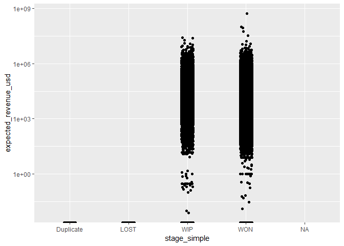
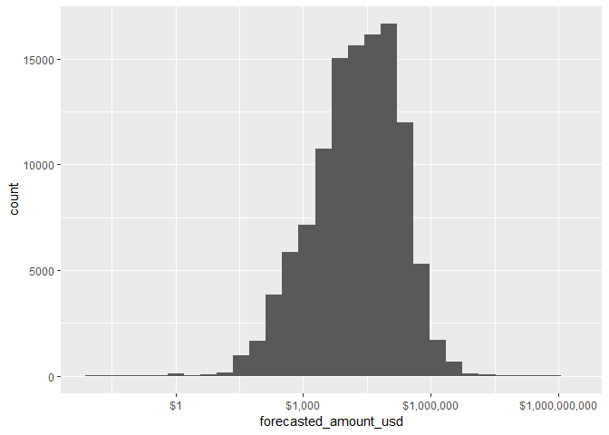
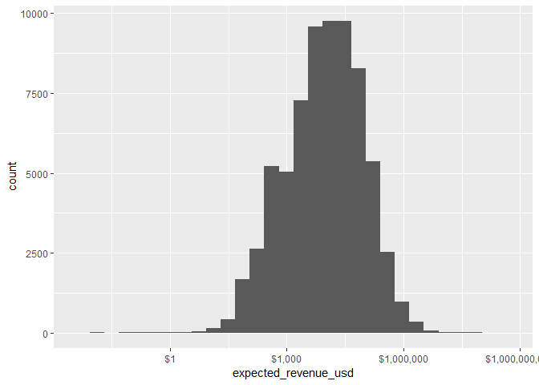
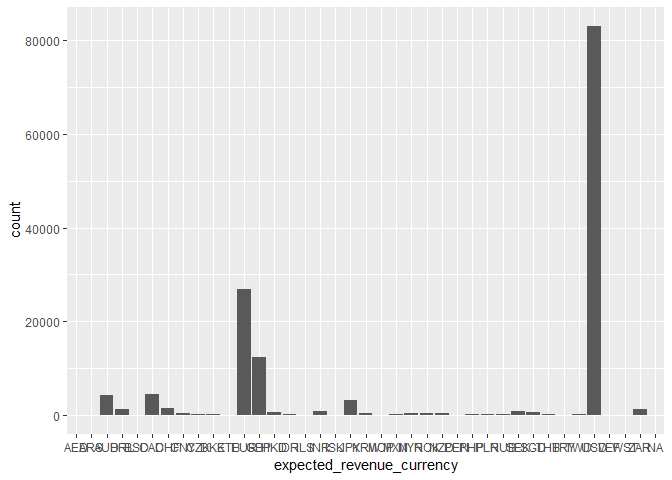
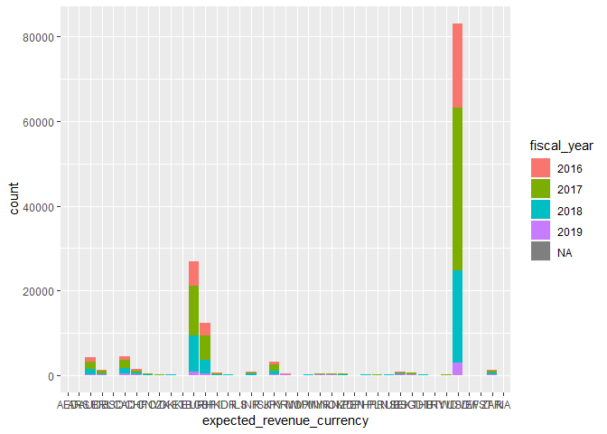
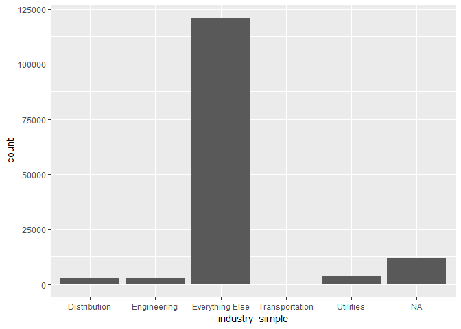
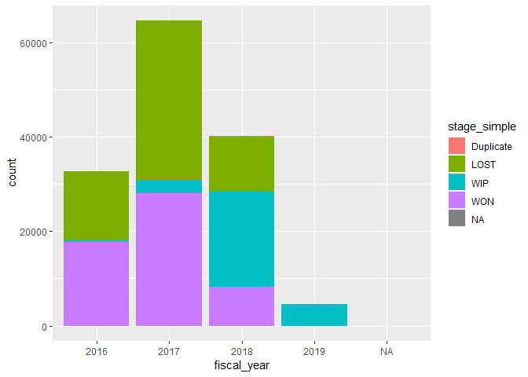

R Markdown
----------

This is an R Markdown document. Markdown is a simple formatting syntax
for authoring HTML, PDF, and MS Word documents. For more details on
using R Markdown see <http://rmarkdown.rstudio.com>.

When you click the **Knit** button a document will be generated that
includes both content as well as the output of any embedded R code
chunks within the document. You can embed an R code chunk like this:

Importing Opportunities Spreadsheet
-----------------------------------

Original data is in Microsoft Excel spreadsheet,
Opportunities\_2016\_2018.xlsx

    ##  account_name       opportunity_name   opportunity_type  
    ##  Length:142315      Length:142315      Length:142315     
    ##  Class :character   Class :character   Class :character  
    ##  Mode  :character   Mode  :character   Mode  :character  
    ##                                                          
    ##                                                          
    ##                                                          
    ##                                                          
    ##  lead_source        forecasted_amount_currency forecasted_amount   
    ##  Length:142315      Length:142315              Min.   :-3.685e+06  
    ##  Class :character   Class :character           1st Qu.: 3.450e+02  
    ##  Mode  :character   Mode  :character           Median : 1.000e+04  
    ##                                                Mean   : 9.987e+05  
    ##                                                3rd Qu.: 8.190e+04  
    ##                                                Max.   : 1.622e+10  
    ##                                                                    
    ##  expected_revenue_currency expected_revenue    
    ##  Length:142315             Min.   :  -3684507  
    ##  Class :character          1st Qu.:         0  
    ##  Mode  :character          Median :         0  
    ##                            Mean   :    285831  
    ##                            3rd Qu.:     10094  
    ##                            Max.   :2433265645  
    ##                                                
    ##    close_date                   next_step            stage          
    ##  Min.   :2016-01-01 00:00:00   Length:142315      Length:142315     
    ##  1st Qu.:2016-07-21 00:00:00   Class :character   Class :character  
    ##  Median :2017-02-10 00:00:00   Mode  :character   Mode  :character  
    ##  Mean   :2017-02-26 15:44:49                                        
    ##  3rd Qu.:2017-09-06 00:00:00                                        
    ##  Max.   :2018-12-31 00:00:00                                        
    ##  NA's   :7                                                          
    ##  fiscal_quarter     fiscal_year             age        
    ##  Length:142315      Length:142315      Min.   :   0.0  
    ##  Class :character   Class :character   1st Qu.:  13.0  
    ##  Mode  :character   Mode  :character   Median :  91.0  
    ##                                        Mean   : 222.9  
    ##                                        3rd Qu.: 295.0  
    ##                                        Max.   :5962.0  
    ##                                        NA's   :7       
    ##   created_date                 opportunity_owner   owner_role       
    ##  Min.   :2001-03-10 00:00:00   Length:142315      Length:142315     
    ##  1st Qu.:2016-01-29 00:00:00   Class :character   Class :character  
    ##  Median :2016-08-12 00:00:00   Mode  :character   Mode  :character  
    ##  Mean   :2016-06-29 11:57:14                                        
    ##  3rd Qu.:2017-03-24 00:00:00                                        
    ##  Max.   :2017-11-19 00:00:00                                        
    ##  NA's   :7                                                          
    ##    industry            sic_code        description       
    ##  Length:142315      Min.   :      11   Length:142315     
    ##  Class :character   1st Qu.:    3679   Class :character  
    ##  Mode  :character   Median :    5943   Mode  :character  
    ##                     Mean   :  165121                     
    ##                     3rd Qu.:    7374                     
    ##                     Max.   :96410000                     
    ##                     NA's   :43972                        
    ##  stage_simple       currency_symbol    currency_rate    
    ##  Length:142315      Length:142315      Min.   :0.00003  
    ##  Class :character   Class :character   1st Qu.:1.00000  
    ##  Mode  :character   Mode  :character   Median :1.00000  
    ##                                        Mean   :1.00921  
    ##                                        3rd Qu.:1.25000  
    ##                                        Max.   :1.38000  
    ##                                        NA's   :7        
    ##  forecasted_amount_usd expected_revenue_usd industry_simple   
    ##  Min.   :  -3214097    Min.   : -3214097    Length:142315     
    ##  1st Qu.:       345    1st Qu.:        0    Class :character  
    ##  Median :      9779    Median :        0    Mode  :character  
    ##  Mean   :    162524    Mean   :    41199                      
    ##  3rd Qu.:     70000    3rd Qu.:     9433                      
    ##  Max.   :1220842100    Max.   :521876775                      
    ##  NA's   :7             NA's   :7

