STAGE: Count of Forecasted Dollar Amount (USD)
==============================================

This first plot shows the count (number of deals) and where they fall in
a range of US dollars ($) for the projected Forecasted Dollar Amount
(what the deal was proposed to the customer for). As you can see, the
vast majority of them fall in a range between USD 500 and USD 1 million,
with the concentration being between USD 1,000 and 900,000.

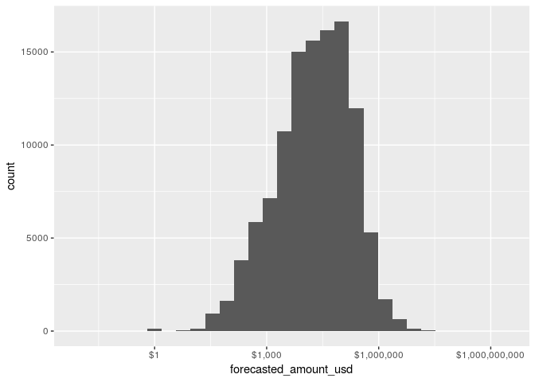

STAGE: Count of Expected Revenue Amount (USD)
=============================================

The Expected Revenue is the amount of money we expect to make from the
the deal when it closes and commits. A deal might be forecasted for USD
500,000, and the expected revenue might be USD 250,000 (meaning there
are USD 250,000 of costs).

The bar plot below for Expected should align with the plot above for
Forecasted. Are there noticeable differences in the shape or outline of
these plots? If they are closely match, that indicates that expected
revenue is aligned with the forecasted amount (meaning, costs are
controlled proportionate to the deal). If there is significant
difference, this would suggst that there is a misalignment between what
was Forecasted and what we Expect to make. For example: If Expected
Revenue looks significantly lower, that might indicate that the costs to
staff the project increased, meaning our internal costs consumed more
money, and the expected revenue decreased proprotionately.

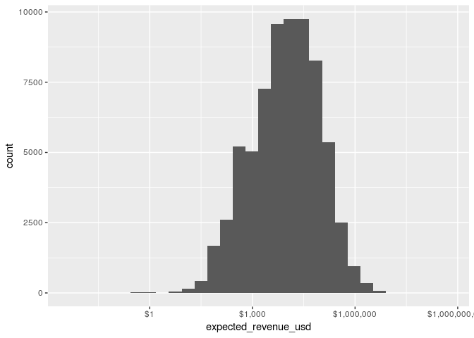

Is there a way to mount one graph on the other?
-----------------------------------------------

STAGE: Count by Year
====================

One of the original questions our group asked is, “What is overall
number of deals we WON AND CLOSED vs. DROPPED and LOST?”

To answer this question, plot a bar graph that shows the 5 categories in
Stage (simple\_stage) and the number of deals in each category. As you
can see in the chart below, only 3 of the categories (WON, LOST, WIP)
have the majority of the deals.
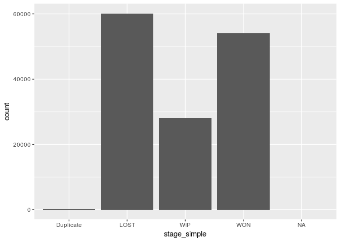

Then we wanted to know, “What is overall number of deals WON AND CLOSED,
vs. DROPPED and LOST, grouped by YEAR?”

Below are two bar graphs showing the same information.

1.  The first chart simply adds a fill to the previous chart (in which
    the Stage is our baseline X axis). This clearly shows 2017 had the
    highest counts of WON and LOST deals, more than 2016 or 2018.

2.  The first chart changes the X asis to the year, and instead uses the
    fill to identify the stage. This makes it less easier to quickly
    identify the year which had the highest counts, but does read
    nicely, and might be used for other charts (e.g. Industry).

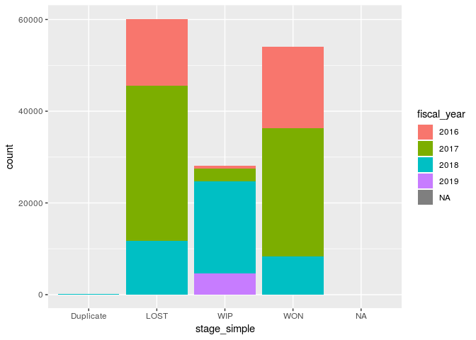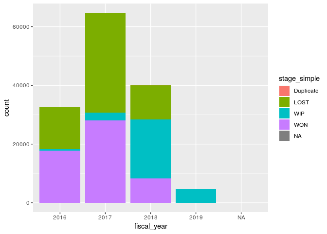

STAGE: Count by Industry
========================

We use the last bar graph as the basis for looking at the count by Stage
across the industries. However, this chart is nearly useless:
“Everything Else” dominates, while our areas of focus (Distribution,
Engineering, Utilities) reduced to very small amounts.

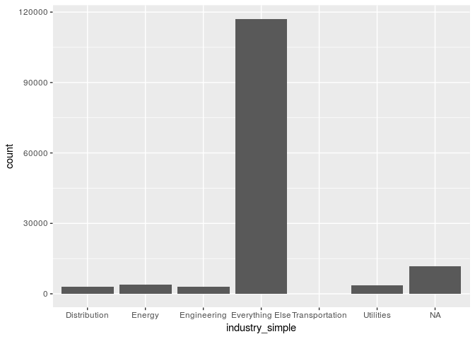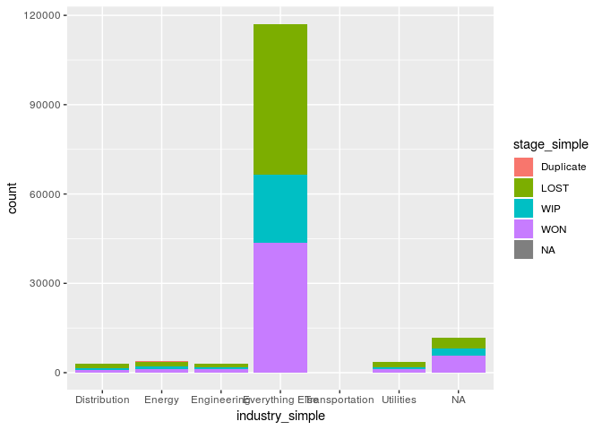

Update Industry Simple with Energy
==================================

It also appears we missed something in our additional cleaning
operation: Where is the “Energy” sector? Turns out, we lumped it with
“Everything Else” incorrectly. So we’ll perform an updated operation and
refresh our graphs.

Now let’s filter out “Everything Else” and concentrate on the Industries
we selected: “Energy” , “Utilities”, “Engineering”,“Distribution”

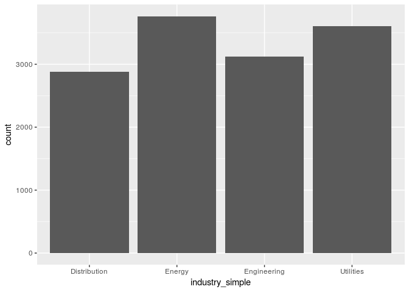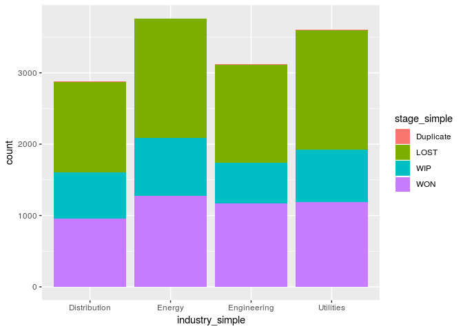

Energy (which comprises Oil, Gas, Fossil and Mineral industries) and
Utilities are the sectors with the most deals.

What if we break down by year?

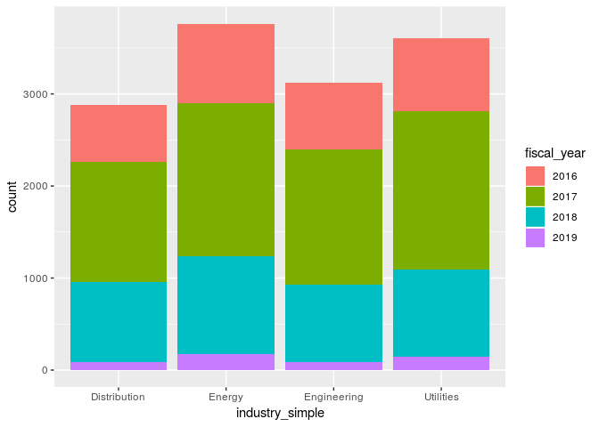

Section 5.3 Questions
=====================

The following are a list of questions from Section 5.3 exercise, which
will be posted to Github.

1.  Can you count something interesting? As seen the charts abobe, we
    counted a number of interesting facts on the amount of deals by
    Forecasted Amount and Expected Revenue, by Stage, and by Industry.

2.  Can you find some trends (high, low, increase, decrease, anomalies)?
    We noticed the following

-   Forecasted Amount and Expected Revenue seemed to be in alignment.
    (Can we statistically say they are correlated? I’m unsure about
    this.)
-   The Year 2017 saw the highest count of WON and LOST deals than any
    other year.
-   The Energy and Utilities sector also saw higher deal activities than
    any other sectors we’re tracking (Distribution, Engineering).

1.  Can you make a bar plot or a histogram? As demonstrated above, we
    made a lot of bar plots and histograms. We might try doing other
    graphics in the subsequent demonstrations.

2.  Can you compare two related quantities? Yes and No. The bar graphs
    above do have fills that allow us to compare data for Stages,
    Industries and Year (depending on the configuration). However, I was
    unable to figure out a way to compare the Forecasted Amount and
    Expected Revenue by putting one graph on top of the other.

3.  Can you make a scatterplot? I can make a scatterplot. However, I’m
    not sure that the volume of data in the Opportunities datafram (over
    200K) lends itself to this kind of visual display, not without
    significant filtering. The bar charts appear to be better at group
    large volumes of records and variables in a visually pleasing way.

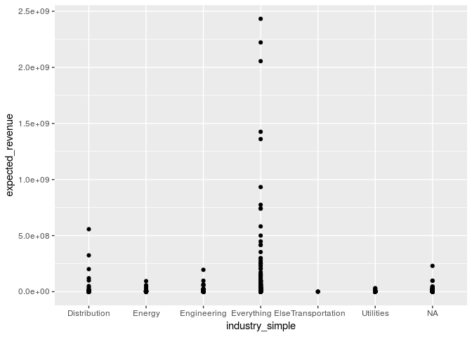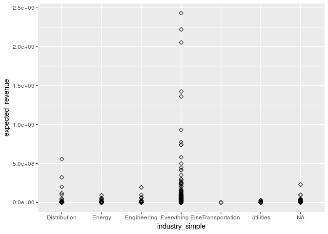

1.  Can you make a time-series plot? The Date/Time values in the
    Opportunities dataframe do not seem to lend themselves to a
    time-series plot. Each record only captures a single Date/Time
    variable for the Opportunity - the Create Date and the Close Date.
    It is not tracking any series of activities for the Opportunity
    except these 2 dates.

What’s Next?
============

Section 5.3 Asks: Having made these plots, what are some insights you
get from them? Do you see any correlations? Is there a hypothesis you
would like to investigate further? What other questions do they lead you
to ask?

Some of my ideas for Section 6 exercises and beyond.

1.  Graphics beyond bar charts, or advanced bar charts (instead of one
    bar with multiple fills, multiple bars grouped together with
    different fills)

2.  Comparisons and correlations for the following variables

-   Lead Source
-   Currency
-   Territory - this could be a new variable, extrapolated from Currency
    (by as Nation instead of Dollar Symbol) - will require additional
    change to dataframe

1.  I think there are more combinatorials to be tried - Dollar Amounts
    vs. Stage, Dollar Amounts vs. Industry, Lead Source vs. Industry

2.  Trying to visualize 3 or 4 sets of variables in the same graph. How
    is this possible?

-   Example: For each Industry, a break down by Year of the number of
    deals WON and LOST, and the Total Dollar Amounts (Forecasted and/or
    Expect) for WON and LOST.
